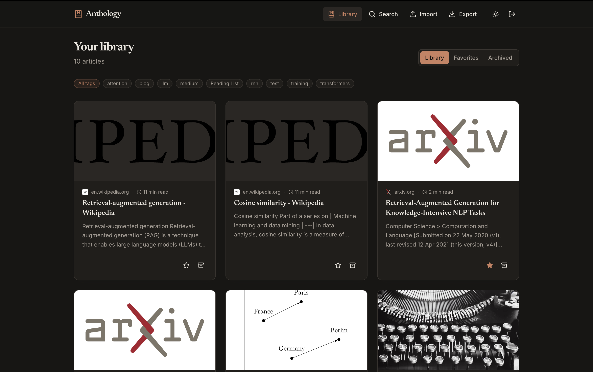
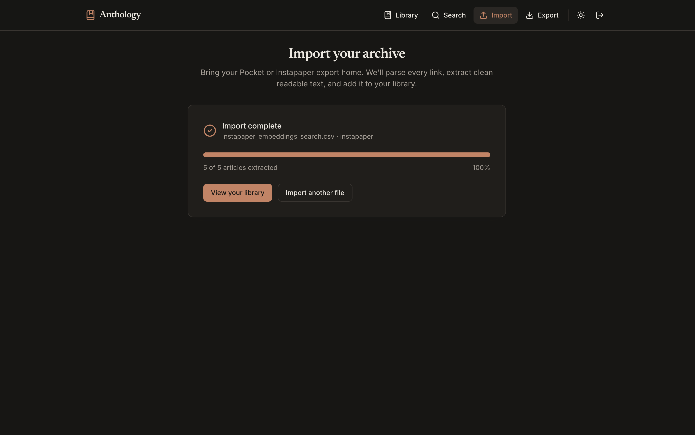
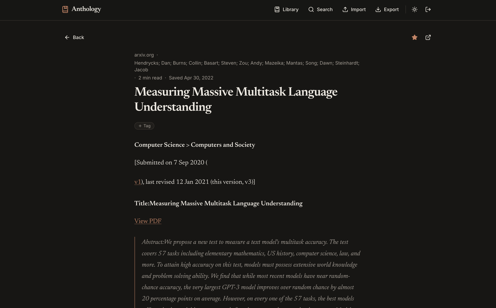
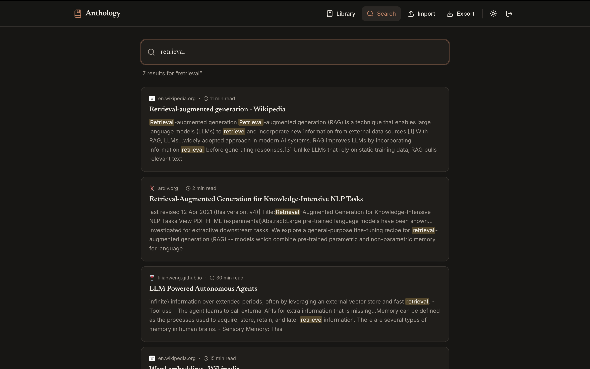

<div align="center">

# Anthology

**Your reading, owned.**

A self-hostable read-later app that ingests your exported Pocket/Instapaper data,
extracts clean article text, and lets you tag, full-text search, and highlight -
owned by you, forever.

<sub>React · TypeScript · Python · FastAPI · PostgreSQL · Docker Compose</sub>

</div>



---

## Why Anthology

Mozilla shut down Pocket in 2025 - the apps stopped working, the service went
export-only, and users were given a hard deadline to export their saved articles
before deletion. That stranded a large base of people mid-migration, each holding
an export file and looking for a new home for years of saved reading.

Most read-later apps start from an empty database and ask you to save new links.
**Anthology starts from what those users actually have: a Pocket/Instapaper export
with thousands of saved URLs.** It is:

- **Migration-first** - a first-class importer for real Pocket and Instapaper export formats.
- **Ownership-first** - self-hosted, your data in your own Postgres, with a clean export path so you are never stranded again.
- **Reading-first** - server-side readable-text extraction, Postgres full-text search across the whole library, and highlights.

---

## Features

- **Google OAuth 2.0 / OIDC** login, with a guarded local dev-login for zero-config demos.
- **Import** Pocket (`.html`) or Instapaper (`.csv`) exports with a live progress UI.
- **Extraction worker** that fetches each URL, pulls out clean readable text (title, byline, lead image, word count, reading time), sanitizes the HTML, and records failures gracefully without crashing the batch.
- **Polished library** - an editorial card grid with cover images, source domains, reading time, tags, and optimistic favorite/archive toggles.
- **Distraction-free reader** with inline highlight rendering and a floating highlight toolbar on text selection.
- **Full-text search** with relevance ranking and highlighted snippet matches.
- **One-click export** of your entire library (articles + tags + highlights) as JSON - the anti-lock-in guarantee.

---

## Architecture

Anthology is **three separate services** sharing one PostgreSQL database, split by
how each part behaves under load and failure:

- **Extraction is slow, bursty, and failure-prone** (dead links, paywalls, timeouts). Isolating it in a worker means a stuck scrape never blocks the read UI.
- **Search is a distinct read concern** with its own query model and tuning. Keeping heavy ranked queries off the gateway keeps the front door fast.
- **The gateway is the fast, user-facing front door** - auth, CRUD, and orchestration - that must stay responsive no matter what the others are doing.

```
                     React + TS (Vite)
                            │ HTTP REST
                            ▼
            ┌───────────────────────────────┐
            │      Gateway / BFF (FastAPI)   │
            │  - Google OAuth / JWT session  │
            │  - articles/tags/highlights    │
            │  - enqueues import/extraction  │
            │  - proxies search queries      │
            └───┬───────────────────┬────────┘
           REST │                   │ REST
                ▼                   ▼
   ┌────────────────────┐  ┌─────────────────────┐
   │  Extraction Worker  │  │    Search Service   │
   │  (FastAPI)          │  │    (FastAPI)        │
   │  - parse imports    │  │  - tsvector/tsquery │
   │  - fetch URL        │  │  - ts_rank ranking  │
   │  - readability +    │  │  - ts_headline      │
   │    sanitize         │  │    snippets         │
   │  - write content    │  └──────────┬──────────┘
   └─────────┬──────────┘             │
             │ SQLAlchemy             │ SQLAlchemy (read)
             ▼                        ▼
            ┌───────────────────────────────┐
            │           PostgreSQL           │
            │  articles, content, tags,      │
            │  highlights + GIN tsvector idx │
            └───────────────────────────────┘
```

The gateway is the only public service; the worker and search are internal to the
Docker Compose network and communicate over REST.

---

## Tech stack

| Layer            | Choice                                                       |
| ---------------- | ------------------------------------------------------------ |
| Frontend         | React 18 + TypeScript (Vite), Tailwind CSS, React Query      |
| Backend          | Python + FastAPI (async), Pydantic v2                        |
| ORM + migrations | SQLAlchemy 2.0 (async) + asyncpg + Alembic                   |
| Database         | PostgreSQL 16 - full-text search via `tsvector` / `tsquery`  |
| Extraction       | trafilatura + BeautifulSoup, `nh3` HTML sanitization         |
| Auth             | Google OAuth 2.0 / OIDC + JWT session cookie (dev fallback)  |
| Packaging        | Docker + Docker Compose                                      |

**Why Postgres full-text search and no external search engine?** A weighted
`tsvector` (title weighted above body) with a GIN index gives ranked results
(`ts_rank`) and highlighted snippets (`ts_headline`) across the whole library - with
no Elasticsearch/Meilisearch to run, back up, or keep in sync. One database, owned
by you.

---

## Quickstart

```bash
git clone https://github.com/harshakallem22/anthology.git
cd anthology
cp .env.example .env
docker compose up --build
```

Then open **http://localhost:5173** and click **"Try the demo (dev login)"**.
Import a sample export from [`samples/`](samples/) to see the full pipeline.

- Web UI: http://localhost:5173
- API + interactive docs: http://localhost:8000/docs

### Optional: enable Google sign-in (~10 min)

The app runs fully offline with the dev-login fallback. To enable real Google login:

1. Google Cloud Console -> **APIs & Services -> Credentials -> Create OAuth client ID -> Web application**.
2. Add the authorized redirect URI (exactly): `http://localhost:8000/auth/google/callback`.
3. Put the Client ID and Secret in `.env` (`GOOGLE_CLIENT_ID`, `GOOGLE_CLIENT_SECRET`).
4. Restart the gateway: `docker compose up -d --force-recreate gateway`.

The dev-login endpoint is guarded by `ENV` and returns 404 in production, so it can
never run there.

---

## Screenshots

**Import - live progress as thousands of links parse and extract**



**Reader - distraction-free, typography-focused, with inline highlights**



**Search - ranked full-text results with highlighted snippet matches**



---

## Testing

Targeted tests cover the most failure-prone path - the importers and the extractor:

```bash
cd extraction
python -m venv .venv && . .venv/bin/activate
pip install -r requirements-dev.txt
pytest
```

They verify that the sample Pocket/Instapaper exports parse into the expected rows,
that a known local HTML fixture extracts the expected title/text with boilerplate
stripped, that sanitized HTML contains no `<script>`, and that a failed fetch is
recorded without raising.

---

## Project structure

```
anthology/
├── docker-compose.yml     # one-command stack: db + gateway + extraction + search + web
├── .env.example
├── samples/               # synthetic Pocket/Instapaper exports (no personal data)
├── gateway/               # FastAPI BFF: auth, articles, tags, highlights, imports, export, search proxy
│   ├── app/{auth,routers,clients}/
│   └── migrations/        # Alembic (owns the schema + FTS trigger)
├── extraction/            # FastAPI worker: importers + fetch/readability/sanitize
│   └── tests/             # importer + extractor tests
├── search/                # FastAPI search: tsvector / ts_rank / ts_headline
└── web/                   # React + TypeScript + Vite + Tailwind
```

---

## Roadmap

Documented next steps beyond the MVP:

- **Durable task queue** (Celery/RQ + Redis) for large imports - background jobs with retries and controlled concurrency.
- **AWS deployment** - services as ECS Fargate tasks, Postgres on RDS, images in ECR.
- **Observability** - structured logs, per-service metrics, and tracing across the gateway -> worker -> search hops.

---

## License

Released under the MIT License.
